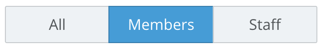
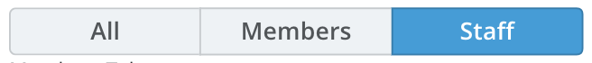

# Fish Tank Buttons

&nbsp; 

### Table Of Contents

- [Usage](#usage)
  - [How to Import ButtonGroup and Button Group Button Components](#to-import-button-components)
  - [How to Export Your Custom Button Components](#to-export-your-custom-vue-components)
- [Button Components](#components)
  - [Button Group Component](#button-group)
  - [Button Group Button](#button-group-button)

- [Props](#universal-props)
  - [Examples of Implementation](#examples-of-implementation)
  - [List of Available Props](#list-of-available-props)

# Usage

&nbsp; 

##### To import button components

```js
import { 
  FishTankButtonGroupButton,
  FishTankButtonGroup,
  }  from '@fishtank/fishtank-vue'
```

&nbsp; 

##### To export your custom Vue components

<!-- In your **export default Vue.extend ( )** class : -->
In your Vue component class
  1. Under components, list the button grop and button components
  2. Under data, you will return your model values to bind to each button component

&nbsp; 

*e.g.*
```js
  export default Vue.extend({

    components:{
      //imported button and button group components
      FishTankButtonGroupButton,
      FishTankButtonGroup,
    },

    data: function(){
      return{
        //prop values that are sent to components
        valueForButtonVModel="default Value"
      }
    },

  })
```

&nbsp; 

# Components

&nbsp; 

See [Usage](#usage) for steps on how to enable button group and button components for usage in your template. The following sub-sections describe each button group and button component and their props.
There are also [actions](#adding-actions) that can be added to each button component . 

*See the [Table of Contents](#table-of-contents) to jump directly to the section you need.*

&nbsp; 

  ## Button Group

  &nbsp; 

  

  &nbsp; 

  ```xml
      <FishTankButtonGroup>
        <FishTankButtonGroupButton
          v-model="valueForButtonVModel"
          value="All"
          label="All"/>
        <FishTankButtonGroupButton
          v-model="valueForButtonVModel"
          value="Members"
          label="Members"/>
        <FishTankButtonGroupButton
          v-model="valueForButtonVModel" 
          value="Staff"
          label="Staff"/>
      </FishTankButtonGroup>
  ```

  ### Small Button Group
  &nbsp; 
  

  &nbsp; 

  ```xml
      <FishTankButtonGroup small>
        <FishTankButtonGroupButton
          v-model="valueForButtonVModel"
          value="All"
          label="All"/>
        <FishTankButtonGroupButton
          v-model="valueForButtonVModel"
          value="Members"
          label="Members"/>
        <FishTankButtonGroupButton
          v-model="valueForButtonVModel" 
          value="Staff"
          label="Staff"/>
      </FishTankButtonGroup>
  ```
  ###### See [Usage](#usage) section for an explanation on how to enable this button component in your template.

  &nbsp; 

  
  
# Adding actions:

Actions applicable to all button components.

```xml
<FishTankButtonGroup small>
  <FishTankBGButton
    v-model="bgValue"
    value="All"
    label="All"
    @click="handleClick"/>
</FishTankButtonGroup>
```
  ###### See [Usage](#usage) section for an explanation on how to enable button components in your template.


# Universal Props

## Button Group Props
&nbsp;

##### Examples of Implementation
```xml
<FishTankButtonGroup small>
  <!-- Button Group Buttons Go here -->
</FishTankButtonGroup>
```

 &nbsp;

 ##### List of Available Props
|Name|Type|Description|Required|Default|
|---|---|---|---|---|
|small|Boolean|Show small button group|false| false|

 ###### See [Usage](#usage) section for an explanation on how to enable button components in your template.

&nbsp;


## Button Group Button Props
&nbsp;

##### Examples of Implementation
```xml
<FishTankButtonGroupButton
  v-model="bgValue"
  value="All"
  label="All"
  :disabled="falsyVariable"/>
```

 &nbsp;

 ##### List of Available Props
|Name|Type|Description|Required|Default|
|---|---|---|---|---|
|value|Boolean, Array, String, Number, Object|Value Prop to be leveraged or emitted by button on click|false| false|
|disabled|Boolean|Specify if button should be disabled|false| false|
|label|String|Button label|true| false|

 ###### See [Usage](#usage) section for an explanation on how to enable button components in your template.
