# Fish Tank Buttons

&nbsp; 

### Table Of Contents

- [Usage](#usage)
  - [How to Import Button Components](#to-import-button-components)
  - [How to Import Icons for Button Components](#to-import-icons-for-your-components)
  - [How to Export Your Custom Button Components](#to-export-your-custom-vue-components)
- [Button Components](#components)
  - [Primary Button](#primary-button)
  - [Secondary Button](#secondary-button)
  - [Destructive Button](#destructive-button)
  - [Outline Button](#outline-button)
  - [Outline Small Button](#outline-small-button)
  - [Outline Dark Button](#outline-dark-button)
  - [Outline Dark Small Button](#outline-dark-small-button)
  - [White Button](#white-button)
  - [Button Primary with _block_ property](#button-primary-with-block-property)
  - [Gradient Button](#gradient-button)
    - [Gradient Button Props](#gradient-button-props)
  - [Feature Button Icon](#feature-button-icon)
  - [Feature Button Icon with Label](#feature-button-icon-with-label)
  - [FAB Button](#fab-button-beta)
    - [FAB Button Props](#fab-button-props)
    - [An Explanation of FAB Button Props](#an-explanation-of-the-fab-button-props)

- [Adding Button Actions](#adding-actions)
- [Universal Button Props](#universal-props)
  - [Examples of Implementation](#examples-of-implementation)
  - [List of Available Props](#list-of-available-props)

# Usage

&nbsp; 

##### To import button components

```js
import { 
  ButtonPrimary,
  ButtonSecondary,
  ButtonDestructive, 
  ButtonOutline,
  ButtonOutlineSmall, 
  ButtonGradient , 
  ButtonWhite,
  ButtonOutlineDark,
  ButtonOutlineDarkSmall,
  ButtonFeatureIcon,
  ButtonFeatureLabel, }  from '@fishtank/fishtank-vue'
```

&nbsp; 

##### To import icons for your components

*Desired icons must be individually imported from '@fishtank/icons-vue' **and** listed among exported components or they will not render.* Icons must be referenced using **camel case** not kebab. *e.g. MobileInactive24*  

&nbsp; 

```js
  import { Alert24 } from "@fishtank/icons-vue"
```

&nbsp; 

##### To export your custom Vue components

In your **export default Vue.extend ( )** class :
  1. Under components, list each type of button and icon that will be used.
  2. Under data, you will return your prop values to the button components
  &nbsp; e.g. color, color direction, links, and text.

&nbsp; 

*e.g.*
```js
  export default Vue.extend({

    components:{
      //imported buttons that will be used
      ButtonFeatureLabel,
      ButtonGradient,
      //imported icons that will be referenced in button components
      Alert24,
    },

    data: function(){
      return{
        //prop values that are sent to components
        colorStart : "#0018AB",
        colorEnd : "9933CC",
        colorDirection : "to right",
      }
    },

  })
```

&nbsp; 

# Components

&nbsp; 

See [Usage](#usage) for steps on how to enable button components for usage in your template. The following sub-sections describe each button component and their props. In Addition to the props unique to each button component there are [universal props](#universal-props) that apply to each button ( *with the exception of the FAB Button that is still in beta* ) . There are also [actions](#adding-actions) that can be added to each button component . 

*See the [Table of Contents](#table-of-contents) to jump directly to the section you need.*

&nbsp; 

  ## Primary Button

  &nbsp; 

  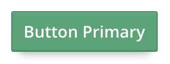

  &nbsp; 

  ```xml
      <ButtonPrimary>Button Primary</ButtonPrimary>
  ```
  ###### See [Usage](#usage) section for an explanation on how to enable this button component in your template.

  &nbsp; 

  ## Secondary Button

  &nbsp; 

  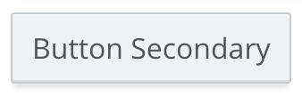

  &nbsp; 

  ```xml
      <ButtonSecondary>Button Secondary</ButtonSecondary>
  ```
  ###### See [Usage](#usage) section for an explanation on how to enable this button component in your template.

  &nbsp; 

  ## Destructive Button

  &nbsp; 

  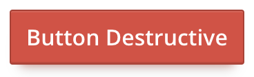

  &nbsp; 

  ```xml
      <ButtonDestructive>Button Destructive</ButtonDestructive>
  ```
  ###### See [Usage](#usage) section for an explanation on how to enable this button component in your template.


  &nbsp; 
 
  ## Outline Button

  &nbsp; 

  

  &nbsp; 

  ```xml
      <ButtonOutline>Button Outline</ButtonOutline>
  ```
  ###### See [Usage](#usage) section for an explanation on how to enable this button component in your template.


  &nbsp; 

  ## Outline Small Button

  &nbsp; 

  

  &nbsp; 

  ```xml
      <ButtonOutlineSmall>Button Outline Small</ButtonOutlineSmall>
  ```
  ###### See [Usage](#usage) section for an explanation on how to enable this button component in your template.


  &nbsp; 

  ## Outline Dark Button

  ( For use on Dark Backgrounds )

  &nbsp; 

  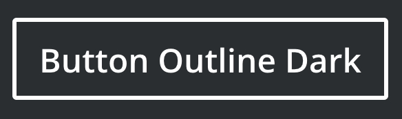

  &nbsp; 

  ```xml
      <ButtonOutlineDark>Button Outline Dark</ButtonOutlineDark>
  ```
  ###### See [Usage](#usage) section for an explanation on how to enable this button component in your template.


  &nbsp; 

  ## Outline Dark Small Button

  ( For use on Dark Backgrounds )

  &nbsp; 

  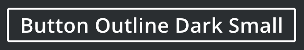

  &nbsp; 

  ```xml
      <ButtonOutlineDarkSmall>Button Outline Dark Small</ButtonOutlineDarkSmall>
  ```
  ###### See [Usage](#usage) section for an explanation on how to enable this button component in your template.

  &nbsp; 

  ## White Button

  &nbsp; 

  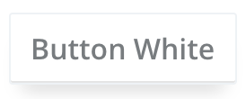

  &nbsp; 

  ```xml
      <ButtonWhite>Button White</ButtonWhite>
  ```
  ###### See [Usage](#usage) section for an explanation on how to enable this button component in your template.


  &nbsp; 

  ## Button Primary with _block_ property 

  &nbsp; 

  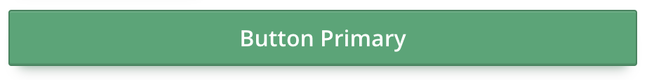

  &nbsp; 

  ```xml
    <ButtonPrimary 
      :block="true">Button Primary</ButtonPrimary>
  ```
  ###### See [Usage](#usage) section for an explanation on how to enable this button component in your template.

  &nbsp; 
  
  ## Gradient Button

  &nbsp; 

  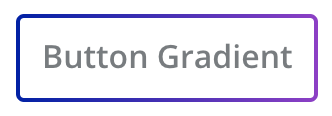

  &nbsp; 

  This button takes in three *required* props **:gradientStart**, **:gradientEnd**, and **:colorDirection**. Return values into these props using a return function in **:data** within your **export default Vue.extend( )** class. See [How to Export Your Custom Button Components](#to-export-your-custom-vue-components) . 

  &nbsp; 

  ```xml
    <ButtonGradient
      :gradientStart="startingHexColorVariable"
      :gradientEnd="endingHexColorVariable"
      :colorDirection="to-right"
      >Button Gradient</ButtonGradient>
  ```

  &nbsp; 

  #### Gradient Button Props

  |Name|Type|Description|Required|Default|
  |---|---|---|---|---|
  |gradientStart|String(Hex color, or valid CSS color)|Start Color of Gradient|true|undefined|
  |gradientEnd|String(Hex color, or valid CSS color)|End Color of Gradient|true|undefined|
  |colorDirection|String("to-right" or "to-left")|Horizontal Direction of Gradient|false|undefined|
  ###### See [Usage](#usage) section for an explanation on how to enable this button component in your template.


  &nbsp; 

 ## Feature Button Icon

  &nbsp; 

  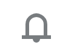

  &nbsp; 

  This button type utilizes both icons and slots, it will require 4 things of you:
  1. Import desired icons from **@fishtank/icons-vue**. See [How to Import Icons for Button Components](#to-import-icons-for-your-components)

  2. Declare them under **:components** in your **export default Vue.extend( )** class. See [How to Export Your Custom Button Components](#to-export-your-custom-vue-components) .
  3. Refer to icons in all cases using camel case.
    a. Do it like this. *'AnAwesomeIcon24'* **(Heroes do this)**
    b. Never do it like this, *'an_awesome_icon_24' or 'an-awesome-icon-24'. **(Only Villians do that.)**
  4. Refer to icon with self closing tags within component. *e.g. '< AnAwesomeIcon24 />'*

  &nbsp; 

  This button simply needs you to reference the desired icon using camel case and self closing brackets within the components.

  &nbsp; 

  ```xml
    <ButtonFeatureIcon> <Alert24/> </ButtonFeatureIcon>
  ```
  ###### See [Usage](#usage) section for an explanation on how to enable this button component in your template.


  &nbsp; 

  ## Feature Button Icon With Label

  &nbsp; 

  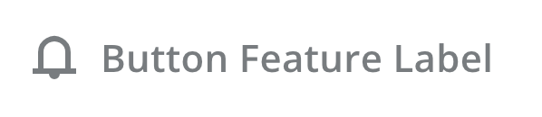

  &nbsp; 

  This button type utilizes both icons and slots, it will require 4 things of you:
  1. Import desired icons from **@fishtank/icons-vue**. See [How to Import Icons for Button Components](#to-import-icons-for-your-components)

  2. Declare them under **:components** in your **export default Vue.extend( )** class. See [How to Export Your Custom Button Components](#to-export-your-custom-vue-components) .
  3. Refer to icons in all cases using camel case.
    a. Do it like this. *'AnAwesomeIcon24'* **(Heroes do this)**
    b. Never do it like this, *'an_awesome_icon_24' or 'an-awesome-icon-24'. **(Only Villians do that.)**
  4. Refer to icon with self closing tags within component. *e.g. '< AnAwesomeIcon24 />'*

&nbsp; 

  This button takes in two required slots that are referenced using the '< template >' tags. The first is the '< template >' that takes in the attribute slot named 'icon'. Between this template tag is where you will reference your 24x24 icon of choice, after you have imported it from '@fishtank/icons-vue'. Remember to reference your icon using self closing tags. The second '< template >' tag takes in a slot named 'label', where you enter the label text.

  &nbsp; 

  ```xml
    <ButtonFeatureLabel> 
        <template slot="icon"> <Alert24/> </template>
        <template slot="label"> Button Feature Label</template>
    </ButtonFeatureLabel>
  ```
  ###### See [Usage](#usage) section for an explanation on how to enable this button component in your template.


  &nbsp; 

  ## FAB Button *(Beta)*

  * **Important** : *This button is currently in Beta, meaning that its props and dependencies will be constantly changing. Until its official release we do not reccomend its use in production, as it will break with updates. Team Fish Tank will keep this documentation up-to-date with information about new and changed props and dependencies.*
  * **Warning** : *Icons in FAB Button may break in Beta.*
  * **Notification** : Gradient color options for FAB Button coming in next update.

  &nbsp;

  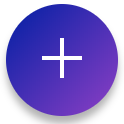&nbsp; &nbsp; &nbsp; &nbsp; &nbsp; &nbsp; &nbsp; &nbsp; &nbsp; &nbsp; 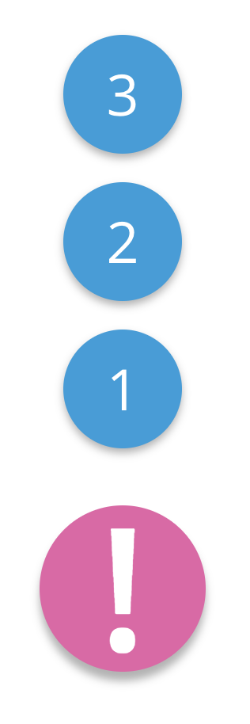&nbsp; &nbsp; 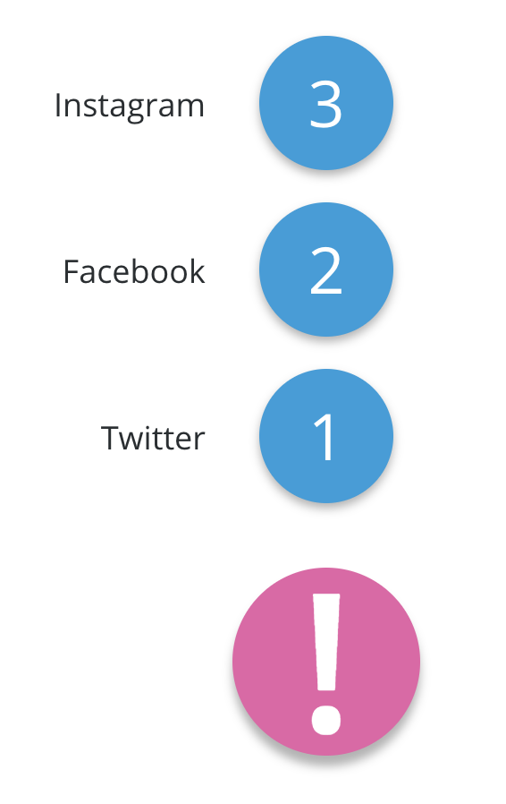
  
  *Default State* &nbsp; &nbsp; &nbsp; &nbsp; &nbsp; &nbsp;  *Hover State ( **no labels** )* &nbsp; &nbsp; &nbsp; &nbsp;  *Hover State( **labels** )*
  
  &nbsp;

  ```xml
      <ButtonFAB 
        :fabOption="ObjectArray" 
        :fabColorPrimary="VarColorPrimary" 
        :fabColorSecondary="VarColorSecondary">
        !   <!--FAB String Character or Icon can be inserted here.-->
      </ButtonFAB>
  ```

  &nbsp;

  #### FAB Button Props

  |Name|Type|Description|Required|Default|
  |---|---|---|---|---|
  |fabColorPrimary | String ( Hex color, or valid css color ) | Color of FAB main button| false | #292e31 |
  |fabColorSecondary | String ( Hex color, or valid css color ) | Color of FAB option buttons| false | #777C7F |
  |fabOption | Array ( Takes in three sub-props ) | Array of FAB option buttons| false | Null|
  |fabOption.icon | String ( Character ) or Icon *( **Beta** )* | Takes in either a string character or icon| false| Null |
  |fabOption.text | String ( Descriptive Label ) | Descriptive text label for option button | fasle| Null |
  |fabOption.links | String ( URL Link ) | URL/Link for FAB option button | false | Null |

  &nbsp;

  ##### An Explanation Of The FAB Button Props

  After adding your FAB Button to your Vue file, following the steps under the [Usage](#usage) Section you will have to assign FAB props values in a **data:** return function in your **export default Vue.extend( )** class.

  The FAB Button takes in three props, the first two are strings ( Hex Colors or valid css colors ) that will determine the color of the FAB Button ( **fabColorPrimary** ) and that of it's mini FAB option buttons ( **fabColorSecondary** ) . The Third prop ( **fabOption** ) is an object array, where each object takes in three values/sub-props called icon ( **fabOption.icon** ) , text ( **fabOption.text** ) , and link ( **fabOption.link** ) . *Currently, there is no limit to how many instances of the FAB mini button that can be passed into the array. We recommend no more than four instances per FAB Button .* 

  &nbsp;

  *See the example below on returning prop values into a FAB Button Component .*

  ```js
    export default Vue.extend({

      // ...

      data: function(){
        return{

          // ...

          // Prop values for FAB Button
          VarColorPrimary : ' #EA60A7 ',
          VarColorSecondary : ' #0D9DDB ',
          ObjectArray : [
            { icon: ' 1 ', text: ' Twitter ', link: ' https://www.twitter.com/ ' },
            { icon: ' 2 ', text: ' Facebok ', link: ' https://www.facebook.com/ ' },
            { icon: ' 3 ', text: ' Instagram ', link: 'https://www.instagram.com/ ' },
          ],
        }
      }
    })

  ```
  ###### See [Usage](#usage) section for an explanation on how to enable this button component in your template.
  
# Adding actions:

Actions applicable to all button components.

```xml
<ButtonPrimary 
  @click="handleClick"
  >Button Primary</ButtonPrimary>
```
  ###### See [Usage](#usage) section for an explanation on how to enable button components in your template.


# Universal Props

*The following props apply to all buttons* .

&nbsp;

##### Examples of Implementation
```xml
<ButtonPrimary
  :disabled="falsyVariable"
  :block="truthyVariable"
  >Button Primary</ButtonPrimary>
```

 &nbsp;

 ##### List of Available Props
|Name|Type|Description|Required|Default|
|---|---|---|---|---|
|disabled|Boolean|Specify if button should be disabled|false| false|
|block|Boolean|Changes Button to full width block element|false| false|

 ###### See [Usage](#usage) section for an explanation on how to enable button components in your template.