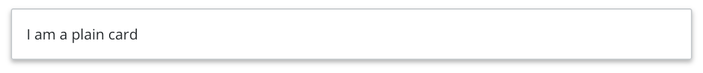
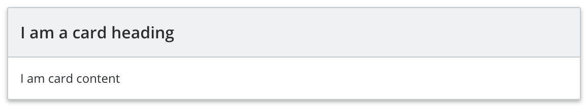
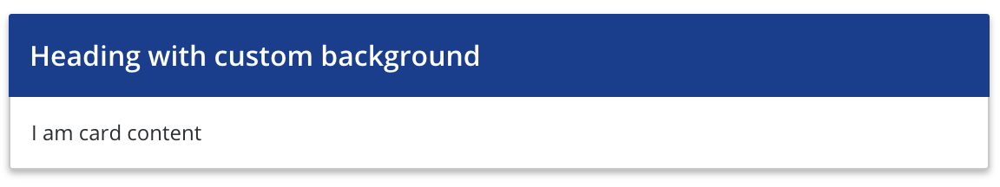
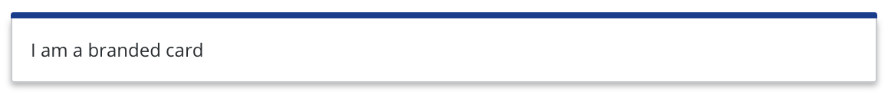

# Fish Tank Cards

  - Plain Card

    
    
    ```xml
    <Card>
      I am a plain card
    </Card>
    ```
  - Card with heading

    
    
    ```xml
    <Card heading="I am a card heading">
      I am card content
    </Card>
    ```

  - Card with heading and custom background

    
    
    ```xml
    <Card>
      <div
        slot="heading"
        slot-scope="{ headerClass }"
        :class="headerClass"
        class="custom-heading"
      >
        Heading with custom background
      </div>
      I am card content
    </Card>
    ```
  
  - Branded Card

    
    
    ```xml
    <Card branded="card-sample-brand-class">
      I am a branded card
    </Card>
    ```
## Usage

To import into your component

```js
import { 
  Card 
}  from '@fishtank/fishtank-vue'
```

## Props

<table>
  <thead>
    <th>Name</th>
    <th>Type</th>
    <th>Description</th>
    <th>Required</th>
    <th>Default</th>
  </thead>
  <tr>
    <td>heading</td>
    <td>String (Hex color, or valid CSS color)</td>
    <td>Start Color of Gradient</td>
    <td>true</td>
    <td>undefined</td>
  </tr>
  <tr>
    <td>branded</td>
    <td>String (Hex color, or valid CSS color)</td>
    <td>End Color of Gradient</td>
    <td>true</td>
    <td>undefined</td>
  </tr>
</table>
