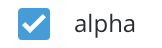
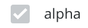
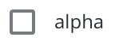
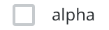

# Fish Tank Checkboxes

  - Checkbox

    
    
    ```xml
    <FishTankCheckbox 
      v-model="valEqualToTrue"
      label="alpha"/>
    ```

  - Disabled Checked Checkbox

    
    
    ```xml
    <FishTankCheckbox 
      v-model="valEqualToTrue"
      disabled
      label="alpha"/>
    ```
 
  - Unchecked Checkbox

    
    
    ```xml
    <FishTankCheckbox 
      v-model="valEqualToFalse"
      label="beta"/>
    ```

  - Disabled Unchecked Checkbox

    
    
    ```xml
    <FishTankCheckbox 
      v-model="valEqualToFalse"
      disabled
      label="beta"/>
    ```

## Usage

To import into your component

```js
import { 
  FishTankCheckbox 
}  from '@fishtank/fishtank-vue'
```

Checkboxes either toggle boolean values:

```xml
<FishTankCheckbox 
  v-model="valToToggleTrueFalse"
  label="Checkbox Label"
  />
```

or push/pup values from an array

```xml
<FishTankCheckbox 
  id="id"
  v-model="arrayValuesPopulateTo"
  value="valueToBePopulated"
  label="Checkbox Label"
/>
```
## Props

<table>
  <thead>
    <th>Name</th>
    <th>Type</th>
    <th>Description</th>
    <th>Required</th>
    <th>Default</th>
  </thead>
  <tr>
    <td>label</td>
    <td>String</td>
    <td>Text Label of Radio</td>
    <td>true</td>
    <td>null</td>
  </tr>
  <tr>
    <td>value</td>
    <td>String,Boolean,Object,Number</td>
    <td>Value to select</td>
    <td>true</td>
    <td>null</td>
  </tr>
  <tr>
    <td>disabled</td>
    <td>Boolean</td>
    <td>Disable the button</td>
    <td>false</td>
    <td>null</td>
  </tr>
</table>