# Fish Tank Content Loaders

&nbsp; 


## Table Of Contents

&nbsp;


- [Usage](#usage)
    - [How to Import Content Loader Component](#how-to-import-content-loader-component)
    - [How to Export Content Loader Component](#how-to-export-content-loader-component)

- [The Content Loader Component](#the-content-loader-component)
    - [Alert List Theme ](#alert-list-theme)
    - [Alert Result Theme ](#alert-result-theme)
    - [Calendar Result Theme ](#calendar-result-theme)
    - [Commitee Result Theme ](#commitee-result-theme)
    - [Directories Result Theme ](#directories-result-theme)
    - [Legislation List Theme](#legislation-list-theme)
    - [Legislation Result Theme](#legislation-result-theme)
    - [Members Of Congress List Theme](#members-of-congress-list-theme)
    - [Members Of Congress Result Theme](#members-of-congress-result-theme)
    - [News List Theme](#news-list-theme)
    - [News Result Theme](#news-result-theme)
    - [Profile Result Theme](#profile-result-theme)
    - [Congressional Staffers List Theme](#congressional-staffers-list-theme)
    - [Custom Content Loader](#custom-content-loader)

- [The Content Loader's Props](#the-content-loaders-props)

&nbsp;

# Usage
See the examples below to learn how to import and export your Content Loader Component.

&nbsp;

## How to Import Content Loader Component

&nbsp;

Simply add ' Loader Content ' to your list of imported components from ' @fishtank/fishtank-vue '.

```js
import { LoaderContent } from '@fishtank/fishtank-vue'
```

&nbsp;

## How to Export Content Loader Component

&nbsp;

After importing ' Loader Content', simply add it to your list of components within your export class.
```js
export default Vue.extend({
    components:{
        Loader Content
    },
})
```

&nbsp;

 ### Click [here](#table-of-contents) to return to the ' Table Of Contents ' 

&nbsp;

# The Content Loader Component

&nbsp;

The Content Loader component is a fully customizable animated svg placeholder for loading content. It comes ready to use with 13 pre-made themes with customizable props such as colors, animation speeds, heights, and widths. In addition to the pre-made themes, users have the option to fully customize their own content loader and use it to create unique svg loaders by adding their own custom shapes.

Below is a list of the Content Loader's different themes and how to call them using the ```theme``` property.

_See [Usage](#usage) for steps on how to enable button components for usage in your template. The following sub-sections describe each of the content loader component's themes, how to customize your own theme, and the component's props._

_See [Props](#the-content-loaders-props) to see all the available props for the content loader component._

&nbsp;

### Click [here](#table-of-contents) to return to the ' Table Of Contents ' 

&nbsp;

## Alert List Theme

&nbsp;

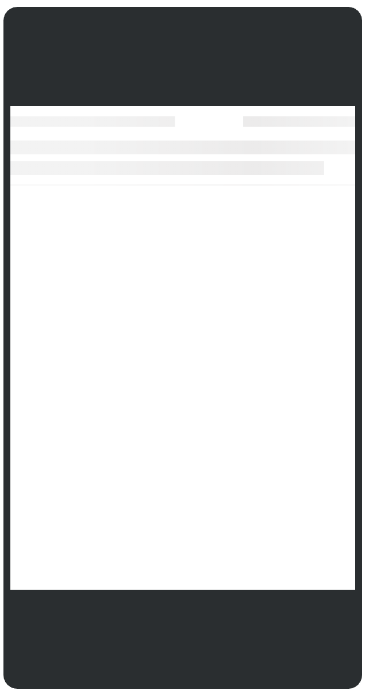

&nbsp;

```xml
    <LoaderContent theme="AlertList"/>
```
#### See [The Content Loader's Props](#the-content-loaders-props) for a complete list of available props that can be used to customize your Content Loader or adjust themes.
##### See [Usage](#usage) section for an explanation on how to enable this component in your template.
### Click [here](#table-of-contents) to return to the ' Table Of Contents ' 

&nbsp;

## Alert Result Theme

&nbsp;

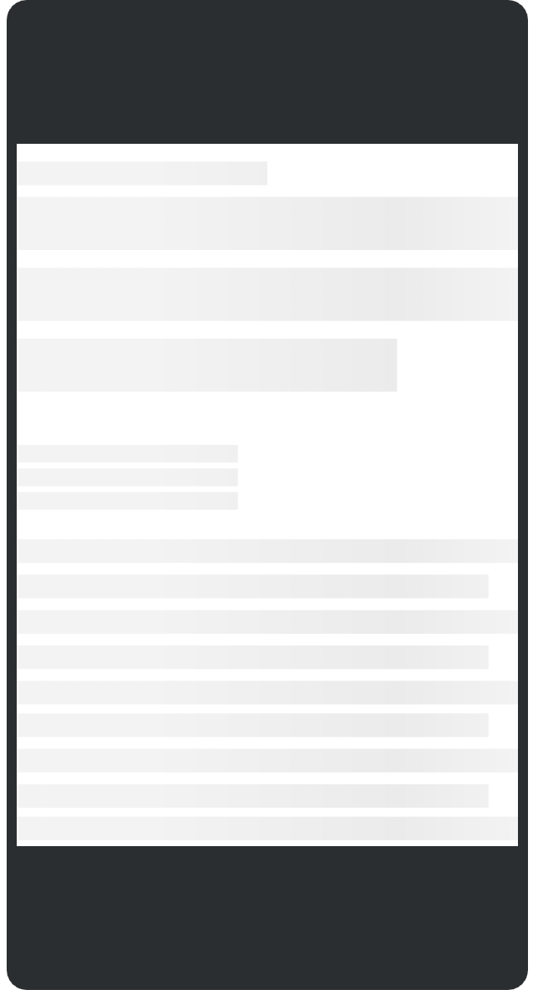

&nbsp;

```xml
    <LoaderContent theme="AlertResult"/>
```
#### See [The Content Loader's Props](#the-content-loaders-props) for a complete list of available props that can be used to customize your Content Loader or adjust themes.
##### See [Usage](#usage) section for an explanation on how to enable this component in your template.
### Click [here](#table-of-contents) to return to the ' Table Of Contents ' 

&nbsp;

## Calendar Result Theme

&nbsp;

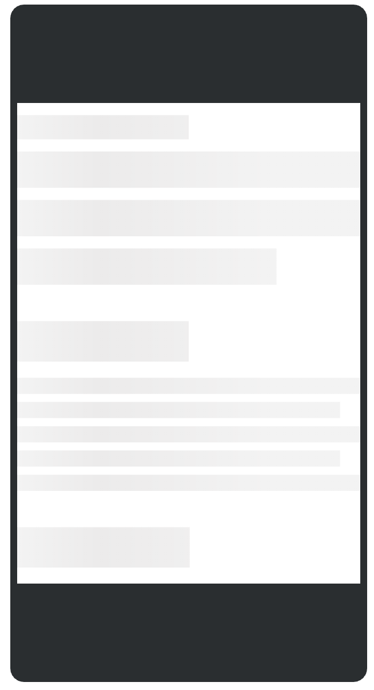

&nbsp;

```xml
    <LoaderContent theme="CalendarResult"/>
```
#### See [The Content Loader's Props](#the-content-loaders-props) for a complete list of available props that can be used to customize your Content Loader or adjust themes.
##### See [Usage](#usage) section for an explanation on how to enable this component in your template.
### Click [here](#table-of-contents) to return to the ' Table Of Contents ' 

&nbsp;

## Commitee Result Theme

&nbsp;

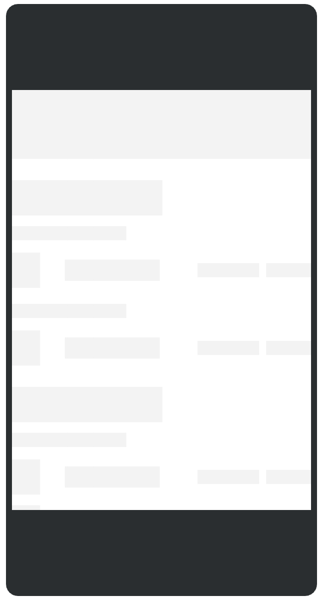

&nbsp;

```xml
    <LoaderContent theme="CommiteeResult"/>
```
#### See [The Content Loader's Props](#the-content-loaders-props) for a complete list of available props that can be used to customize your Content Loader or adjust themes.
##### See [Usage](#usage) section for an explanation on how to enable this component in your template.
### Click [here](#table-of-contents) to return to the ' Table Of Contents ' 

&nbsp;

## Directories Result Theme

&nbsp;

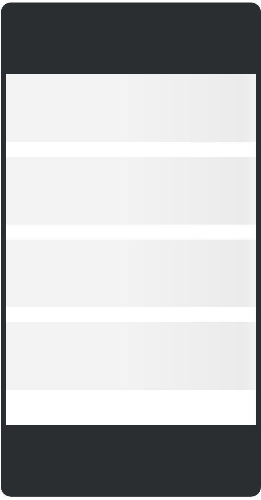

&nbsp;

```xml
    <LoaderContent theme="DirectoriesResult"/>
```
#### See [The Content Loader's Props](#the-content-loaders-props) for a complete list of available props that can be used to customize your Content Loader or adjust themes.
##### See [Usage](#usage) section for an explanation on how to enable this component in your template.
### Click [here](#table-of-contents) to return to the ' Table Of Contents ' 

&nbsp;

## Legislation List Theme

&nbsp;

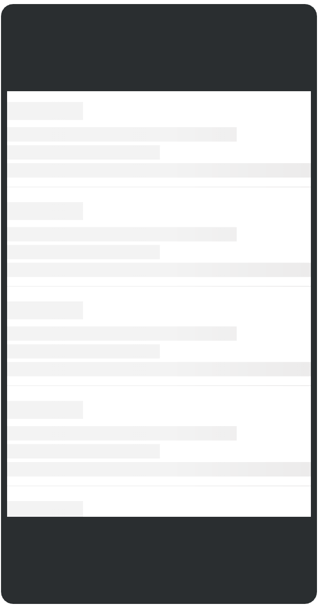

&nbsp;

```xml
    <LoaderContent theme="LegislationList"/>
```
#### See [The Content Loader's Props](#the-content-loaders-props) for a complete list of available props that can be used to customize your Content Loader or adjust themes.
##### See [Usage](#usage) section for an explanation on how to enable this component in your template.
### Click [here](#table-of-contents) to return to the ' Table Of Contents ' 

&nbsp;

## Legislation Result Theme

&nbsp;

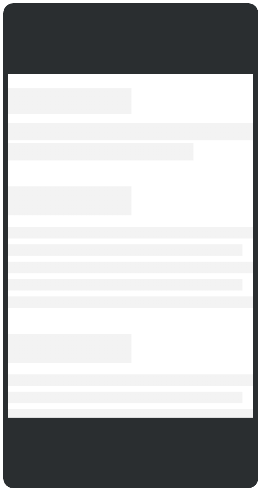

&nbsp;

```xml
    <LoaderContent theme="LegislationResult"/>
```
#### See [The Content Loader's Props](#the-content-loaders-props) for a complete list of available props that can be used to customize your Content Loader or adjust themes.
##### See [Usage](#usage) section for an explanation on how to enable this component in your template.
### Click [here](#table-of-contents) to return to the ' Table Of Contents ' 

&nbsp;

## Members Of Congress List Theme

&nbsp;

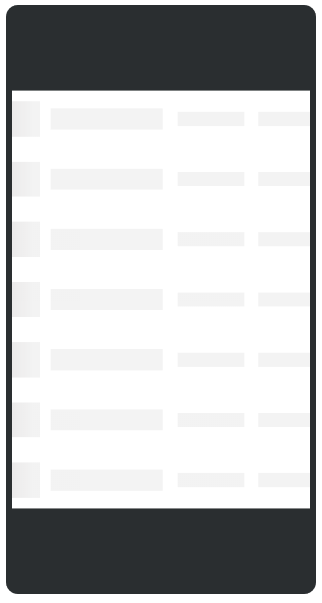

&nbsp;

```xml
    <LoaderContent theme="MembersOfCongressList"/>
```
#### See [The Content Loader's Props](#the-content-loaders-props) for a complete list of available props that can be used to customize your Content Loader or adjust themes.
##### See [Usage](#usage) section for an explanation on how to enable this component in your template.
### Click [here](#table-of-contents) to return to the ' Table Of Contents ' 

&nbsp;

## Members Of Congress Result Theme

&nbsp;

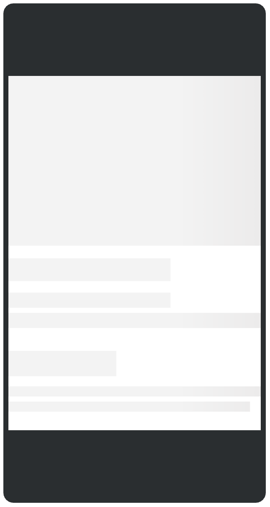

&nbsp;

```xml
    <LoaderContent theme="MembersOfCongressResult"/>
```
#### See [The Content Loader's Props](#the-content-loaders-props) for a complete list of available props that can be used to customize your Content Loader or adjust themes.
##### See [Usage](#usage) section for an explanation on how to enable this component in your template.
### Click [here](#table-of-contents) to return to the ' Table Of Contents ' 

&nbsp;

## News List Theme

&nbsp;

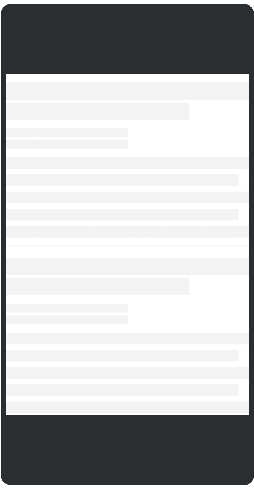

&nbsp;

```xml
    <LoaderContent theme="NewsList"/>
```
#### See [The Content Loader's Props](#the-content-loaders-props) for a complete list of available props that can be used to customize your Content Loader or adjust themes.
##### See [Usage](#usage) section for an explanation on how to enable this component in your template.
### Click [here](#table-of-contents) to return to the ' Table Of Contents ' 

&nbsp;

## News Result Theme

&nbsp;

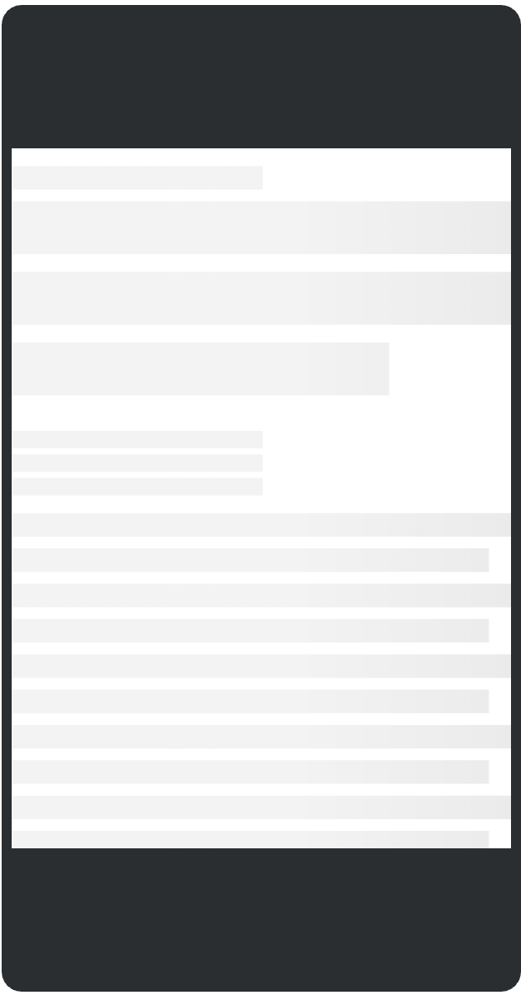

&nbsp;

```xml
    <LoaderContent theme="NewsResult"/>
```
#### See [The Content Loader's Props](#the-content-loaders-props) for a complete list of available props that can be used to customize your Content Loader or adjust themes.
##### See [Usage](#usage) section for an explanation on how to enable this component in your template. 
### Click [here](#table-of-contents) to return to the ' Table Of Contents ' 

&nbsp;

## Profile Result Theme

&nbsp;

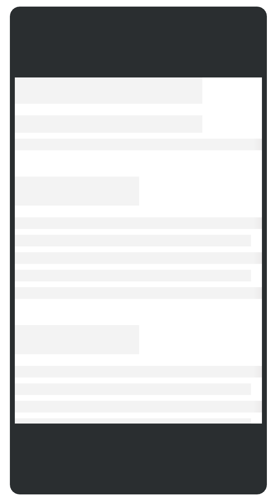

&nbsp;

```xml
    <LoaderContent theme="ProfileResult"/>
```
#### See [The Content Loader's Props](#the-content-loaders-props) for a complete list of available props that can be used to customize your Content Loader or adjust themes.
##### See [Usage](#usage) section for an explanation on how to enable this component in your template.
### Click [here](#table-of-contents) to return to the ' Table Of Contents ' 

&nbsp;

## Congressional Staffers List Theme

&nbsp;

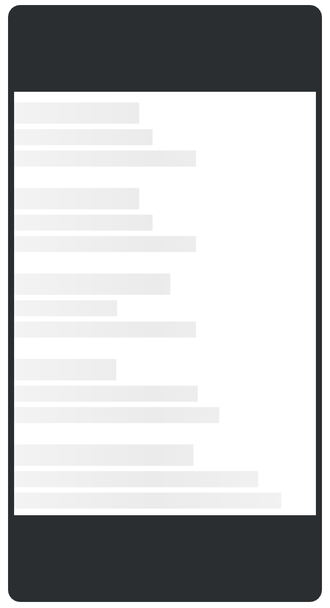

&nbsp;

```xml
    <LoaderContent theme="StaffersList"/>
```
#### See [The Content Loader's Props](#the-content-loaders-props) for a complete list of available props that can be used to customize your Content Loader or adjust themes.
##### See [Usage](#usage) section for an explanation on how to enable this component in your template.
### Click [here](#table-of-contents) to return to the ' Table Of Contents ' 

&nbsp;

## Custom Content Loader

&nbsp;

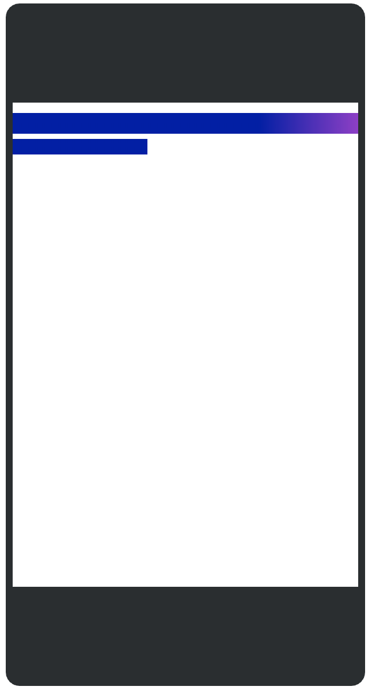

&nbsp;

To customize the Content Loader component, simply add SVG shape elements within the ```<LoaderContent> </LoaderContent> ``` tags. You will also need to declare the width and height of the Content Loader SVG using the ```:loader-height``` and ```:loader-width``` props. You can change the gradient colors using the ```loader-primary-color``` and ```loader-secondary-color``` props. 

The gradient color props belong the Content Loader's Universal Props and apply to all themes as well as the custom component. To see a full list of these props and their applicability see [Content Loader Props](#content-loader-props)

&nbsp;

```xml
    <LoaderContent
          :loader-height = "100" 
          :loader-width = "400"
          :loader-speed = "1.5"
          loader-primary-color = "#0018Ab" 
          loader-secondary-color = "#9933CC"
        >

          <rect 
            x="0" 
            y="12" 
            rx="5" 
            ry="0" 
            width="400" 
            height="24" 
          />

          <rect 
            x="0" 
            y="42" 
            rx="5" 
            ry="0" 
            width="156" 
            height="18" 
          />

        </LoaderContent>
```
#### See [The Content Loader's Props](#the-content-loaders-props) for a complete list of available props that can be used to customize your Content Loader or adjust themes.
##### See [Usage](#usage) section for an explanation on how to enable this component in your template.
 ### Click [here](#table-of-contents) to return to the ' Table Of Contents ' 

&nbsp;

# The Content Loader's Props


*The following props apply to the Content Loader Component regardless of enabled theme* .

&nbsp;

##### Example of Implementation

```xml
    <LoaderContent 
        :loader-height = "100" 
        :loader-width = "400"
        :loader-speed = "1.5"
        loader-primary-color = "#0018Ab" 
        loader-secondary-color = "#9933CC"
        theme="DirectoriesResult"
    />
```
&nbsp;

 ##### List of Available Props
|Name|Type|Description|Required|Default|
|---|---|---|---|---|
|theme|String|Specify pre-made loader content theme |false| null|
|loader-primary-color|String|Determines gradient start value |false| #f3f3f3|
|loader-secondary-color|String|Determines gradient end value |false| #ecebeb|
|:loader-height|Number|Determines height of Content Loader SVG |false| null|
|:loader-width|Number|Determines width of Content Loader SVG |false| 400|
|:loader-speed|Number|Determines speed of loader animation |false| 2 (seconds)|


&nbsp;

 ##### See [Usage](#usage) section for an explanation on how to enable the Content Loader component in your template.
 ### Click [here](#table-of-contents) to return to the ' Table Of Contents ' 
