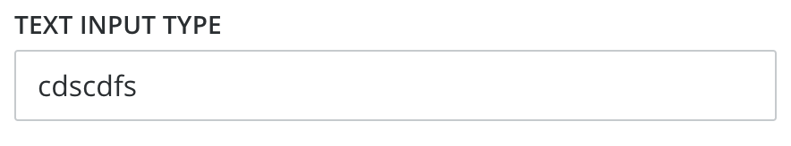
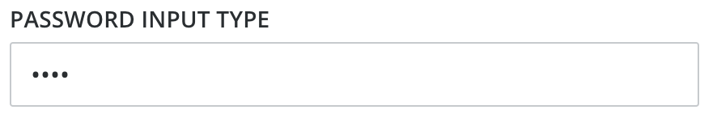
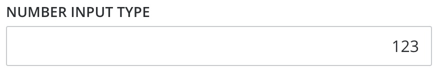
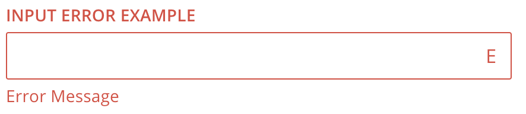

# Fish Tank Text Input

  - Plain Text Input

    
    
    ```xml
    <FishTankTextInput
      :value="val"
      label="Text Input Type"
      type="text"/>
    ```
  
  - Password Input

    
    
    ```xml
    <FishTankTextInput
      :value="val"
      label="Password Input Type"
      type="password"/>
    ```
  
  - Number Input

    
    
    ```xml
    <FishTankTextInput
      :value="val"
      label="Number Input Type"
      type="number"/>
    ```

  - Text Input Error State
  
    
    
    ```xml
    <FishTankTextInput
      :value="val"
      label="Input Error Example"
      type="number"
      error="Error Message"/>
    ```
  
## Usage

To import into your component

```js
import { 
  FishTankTextInput 
}  from '@fishtank/fishtank-vue'
```

## Props

<table>
  <thead>
    <th>Name</th>
    <th>Type</th>
    <th>Description</th>
    <th>Required</th>
    <th>Default</th>
  </thead>
  <tr>
    <td>value</td>
    <td>String</td>
    <td>Text entered into input element</td>
    <td>false</td>
    <td>null</td>
  </tr>
  <tr>
    <td>label</td>
    <td>String</td>
    <td>Input text label</td>
    <td>false</td>
    <td>undefined</td>
  </tr>
  <tr>
    <td>type</td>
    <td>String</td>
    <td>Input type ("text", "password", "email", "search", "number", "tel", "url")</td>
    <td>false</td>
    <td>"text"</td>
  </tr>
  <tr>
    <td>error</td>
    <td>String</td>
    <td>Error state message. <i>If not null, then error state is active, and the value is the error message</i></td>
    <td>false</td>
    <td>null</td>
  </tr>
</table>
