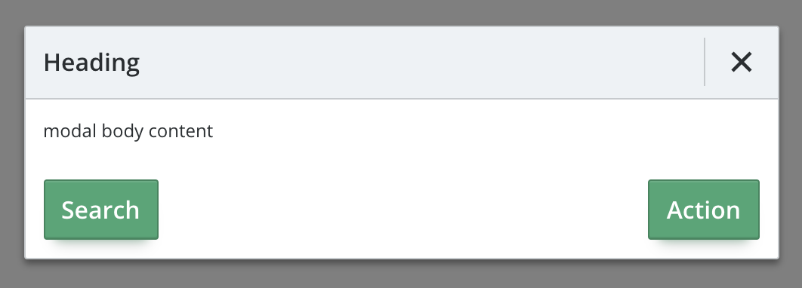
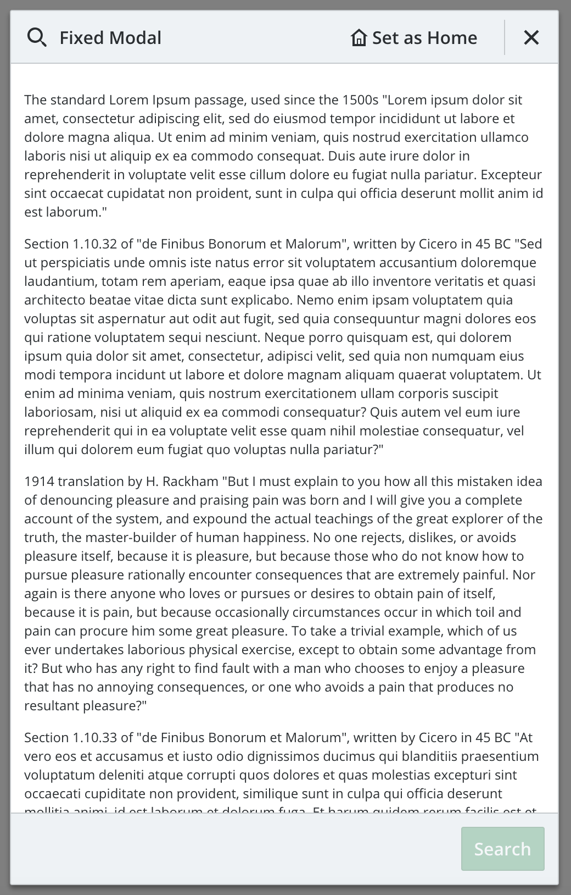
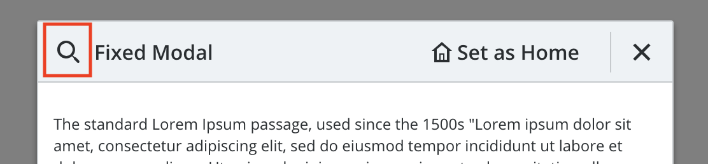
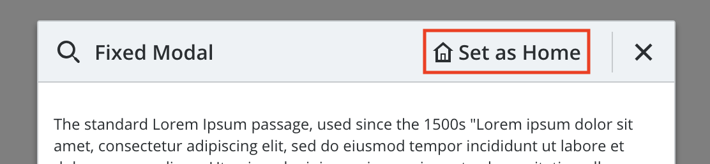
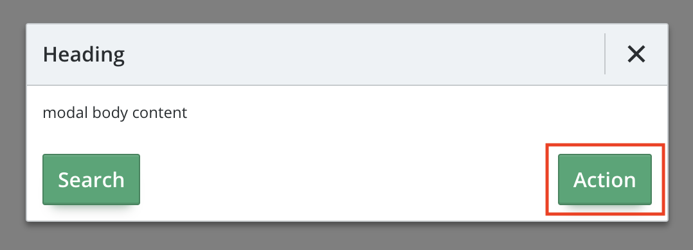
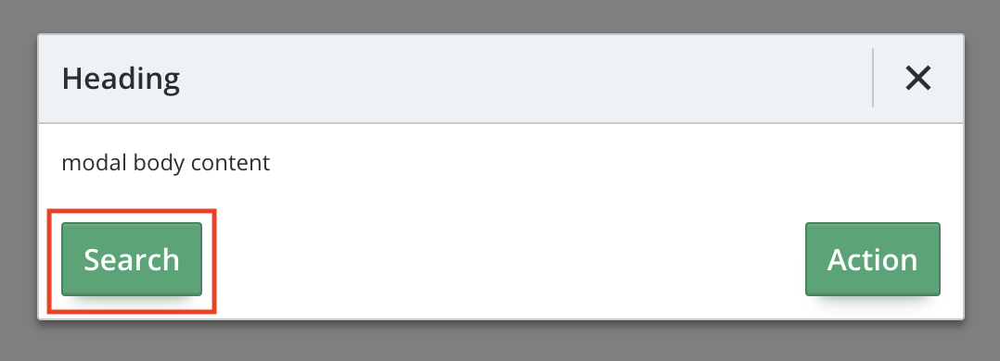

# Fish Tank Modals

  - Standard Modal

    
    
    ```xml
    <FishTankModal
      v-model="modal1"
      heading="Heading"
      escapeable>

      modal body content

      <div slot="footerRight">
        <ButtonPrimary>Action</ButtonPrimary>
      </div>

      <div slot="footerLeft">
        <ButtonPrimary>Search</ButtonPrimary>
      </div>

    </FishTankModal>
    ```
  
  - Fixed Modal

    
    
    ```xml
    <Modal
      v-model="modal2"
      heading="Fixed Modal"
      class="my-custom-class"
      fixed>
      
      <Search24 slot="headingIcon"/>
      <LoremIpsum/>
      <template slot="headingExtra">
        <Home24/>
        Set as Home
      </template>
      
      <div slot="footerRight">
        <ButtonPrimary disabled>Search</ButtonPrimary>
      </div>
    </Modal>
    ```

    - Dialog Box Modal

    
    
    ```xml
    <DialogBox
      v-model="dialog"
      width="250px"
      heading="Heading"
      escapeable
      dialog>

      message

    </DialogBox>
    ```
## Usage

To import the Modal into your component

```js
import { 
  FishTankModal 
}  from '@fishtank/fishtank-vue'
```

To import the Dialog Box into your component

```js
import { 
  DialogBox 
}  from '@fishtank/fishtank-vue'
```

## Props

<table>
  <thead>
    <th>Name</th>
    <th>Type</th>
    <th>Description</th>
    <th>Required</th>
    <th>Default</th>
  </thead>
  <tr>
    <td>heading</td>
    <td>String (Hex color, or valid CSS color)</td>
    <td>Start Color of Gradient</td>
    <td>true</td>
    <td>undefined</td>
  </tr>
  <tr>
    <td>fixed</td>
    <td>Boolean</td>
    <td>Sets the modal height at 100% of the available space in the viewport</td>
    <td>false</td>
    <td>false</td>
  </tr>
  <tr>
    <td>dialog</td>
    <td>Boolean</td>
    <td>Modal type is a dialog prompt</td>
    <td>false</td>
    <td>false</td>
  </tr>
  <tr>
    <td>active</td>
    <td>Boolean</td>
    <td>Sets the modal as active, to manage whether to continue showing the modal if model data changes</td>
    <td>false</td>
    <td>false</td>
  </tr>
  <tr>
    <td>escapable</td>
    <td>Boolean</td>
    <td>The <b>esc</b> button can close the Modal</td>
    <td>false</td>
    <td>false</td>
  </tr>
  <tr>
    <td>width</td>
    <td>String</td>
    <td>The width of the Modal</td>
    <td>false</td>
    <td>undefined</td>
  </tr>
</table>

## Slots

| headingIcon  |
|---|
| Slot property for heading icon  |
|``` <Search24 slot="headingIcon"/> ```|
||

| headingExtra  |
|---|
| Slot heading extra area |
|``` <template slot="headingExtra"><Home24/>Set as Home</template>```|
||

| footerRight  |
|---|
| Slot footer right area |
|``` <div slot="footerRight"><ButtonPrimary>Action</ButtonPrimary></div> ```|
||

| footerLeft  |
|---|
| Slot footer left area |
|``` <div slot="footerLeft"><ButtonPrimary>Search</ButtonPrimary></div> ```|
||
