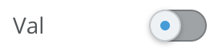
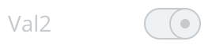

# Fish Tank Switches

  - Switch

    
    
    ```xml
    <InputSwitch 
      v-model="valEqualToFalseOfNull"
      label="Switch Label"
      />
    ```

  - Disabled Switch

    
    
    ```xml
    <InputSwitch 
      v-model="valEqualToFalseOfNull"
      disabled
      label="Switch Label"
      />
    ```
 
  - Active Switch

    
    
    ```xml
    <InputSwitch 
      v-model="valEqualToTrue"
      value="beta" 
      label="Switch Label"
      />
    ```

  - Disabled Active Switch

    
    
    ```xml
    <InputSwitch 
      v-model="valEqualToAlpha"
      disabled
      value="beta" 
      label="Switch Label"
      />
    ```

## Usage

To import into your component

```js
import { 
  Switch 
}  from '@fishtank/fishtank-vue'
```

Switches extend the functionality of HTML input checkbox elements in Vue. They either toggle Boolean values:

```xml
<InputSwitch 
  v-model="valToToggleTrueFalse"
  label="Switch Label"
  />
```

or push/pup values from an array

```xml
<InputSwitch 
  id="id"
  v-model="arrayValuesPopulateTo"
  value="valueToBePopulated"
  label="Switch Label"
/>
```
## Props

<table>
  <thead>
    <th>Name</th>
    <th>Type</th>
    <th>Description</th>
    <th>Required</th>
    <th>Default</th>
  </thead>
  <tr>
    <td>id</td>
    <td>String</td>
    <td>Element ID</td>
    <td>false</td>
    <td>null</td>
  </tr>
  <tr>
    <td>value</td>
    <td>String,Boolean,Object,Number, Array</td>
    <td>Value to added or removed from array of selected items. Used when v-model is bound to an array</td>
    <td>false</td>
    <td>null</td>
  </tr>
  <tr>
    <td>label</td>
    <td>Boolean</td>
    <td>Switch Label</td>
    <td>true</td>
    <td>null</td>
  </tr>
  <tr>
    <td>disabled</td>
    <td>Boolean</td>
    <td>Disable the switch</td>
    <td>false</td>
    <td>null</td>
  </tr>
</table>