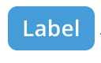
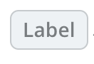
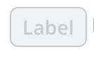
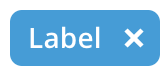

# Fish Tank Tags

  - Selected Tag

    
    
    ```xml
    <FishTankTag 
      v-model="truthyVariable"
      label="Label"/>
    ```
  
  - Unselected Tag

    
    
    ```xml
    <FishTankTag 
      v-model="falsyVariable"
      label="Label"/>
    ```

  - Disabled Tag

    
    
    ```xml
    <FishTankTag 
      v-model="falsyVariable"
      label="Label"
      disabled/>
    ```
  
  - Removable Tag

    
    
    ```xml
    <FishTankTagRemove 
        :label="label"/>
    ```
  
## Usage

To import into your component

```js
import { 
  FishTankTag,
  FishTankTagRemove,  
}  from '@fishtank/fishtank-vue'
```

## Props

<table>
  <thead>
    <th>Name</th>
    <th>Type</th>
    <th>Description</th>
    <th>Required</th>
    <th>Default</th>
  </thead>
  <tr>
    <td>label</td>
    <td>String</td>
    <td>Tag label</td>
    <td>true</td>
    <td>undefined</td>
  </tr>
  <tr>
    <td>disabled</td>
    <td>Boolean</td>
    <td>Disable Tag</td>
    <td>false</td>
    <td>false</td>
  </tr>
  <tr>
    <td>remove</td>
    <td>Boolean</td>
    <td>Show remove icon</td>
    <td>false</td>
    <td>false</td>
  </tr>
  <tr>
    <td>multi-select</td>
    <td>Boolean</td>
    <td>Show multi-select icon</td>
    <td>false</td>
    <td>false</td>
  </tr>
</table>
